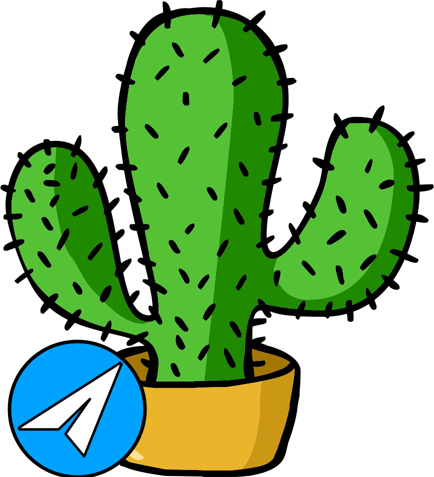

[](https://www.l3r8y.ru)

[](https://www.elegantobjects.org)
[](http://www.rultor.com/p/objectionary/eo)
[](https://www.jetbrains.com/idea/)

[](https://www.0pdd.com/p?name=l3r8yJ/elegram-api)
[](https://www.codacy.com/gh/l3r8yJ/elegram-api/dashboard?utm_source=github.com&amp;utm_medium=referral&amp;utm_content=l3r8yJ/elegram-api&amp;utm_campaign=Badge_Grade)
[](https://codecov.io/gh/l3r8yJ/elegram-api)

__Elegram-api__ is a wrapper over the telegram bots api, but in the style of [EO](https://www.eolang.org). More object-oriented, more maintainable.
## Concept
This is a concept, if you have ideas, feel free to create an issue!

```java
import com.l3r8yj.elegramapi.Bot;
import com.l3r8yj.elegramapi.Command;
import com.l3r8yj.elegramapi.Update;
import com.l3r8yj.elegramapi.bot.BtDefault;
import java.util.Objects;

/**
 * Simple example.
 */
class App() {
    public static void main(String[] args) {
        new BtDefault(
            "your token",
            new CmdStart()
        ).start();
    }
}

// this is a temporary solution, it will be changed later
class CmdStart() extends Command {
    @Override
    public void act(final Update update, final Bot bot) {
        if (Objects.equals("/start", update.message().text())) {
            bot.sendMessage(
                update.message().chatId(),
                "Hi, this is a start command"
            );
        }
    }
}
```
## Why does this project exist?
This project solves the problem of the existing telegram-bots-api, which for some reason isn't _"Object-Oriented"_,
here we can create a wrapper around the original API and make it more _"Object-Oriented"_. 

_What do I mean when I say object-oriented?_
> _So let's look at [cactoos](https://github.com/yegor256/cactoos) library, I think you get the idea._
## How to Contribute
Fork repository, make changes, send us a [pull request](https://www.yegor256.com/2014/04/15/github-guidelines.html).
We will review your changes and apply them to the `master` branch shortly,
provided they don't violate our quality standards. To avoid frustration,
before sending us your pull request please run full Maven build:
```bash
mvn clean install
```
You will need [Maven 3.3+](https://maven.apache.org) and Java 8+ installed
## Reasons to reject your code
  - [Empty lines.](https://www.yegor256.com/2014/11/03/empty-line-code-smell.html)
  - [Compound names.](https://www.yegor256.com/2015/01/12/compound-name-is-code-smell.html)
  - [Incorrect formatting.](https://www.yegor256.com/2014/10/23/paired-brackets-notation.html)
  - [Mutability.](https://www.yegor256.com/2014/06/09/objects-should-be-immutable.html)
  - [Getters/Setters.](https://www.yegor256.com/2014/09/16/getters-and-setters-are-evil.html)
  - [Static methods.](https://www.yegor256.com/2017/02/07/private-method-is-new-class.html)
  - [Pull request with feature but without unit-tests.](https://www.yegor256.com/2022/08/04/code-and-tests-different-pull-requests.html)
  
This short list is supposed to make you understand that __we aren't picking on you__, it's just a __level of quality below which we can't accept__. 
## Tests
We're using [this plugin](https://github.com/volodya-lombrozo/test-naming-conventions) to control naming for tests, please note that.

_Looking forward to your pull-request!_


## Stargazers over time

[](https://starchart.cc/l3r8yJ/elegram-api)
